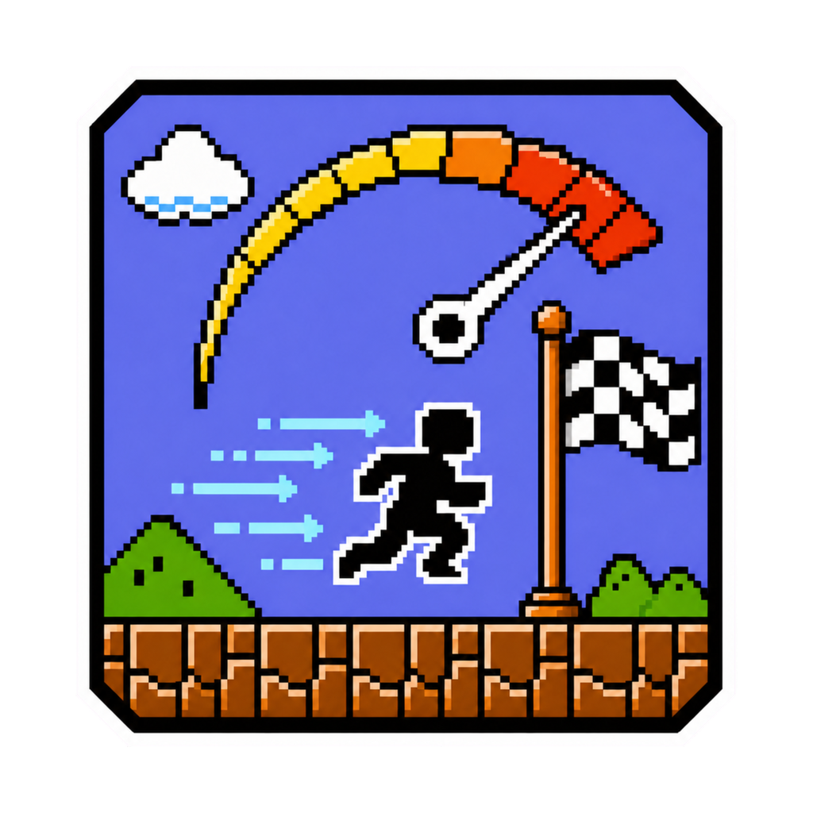

<div align="center">
  

  **🚀 Blazing fast SuperMarioBros-Nes environment for Reinforcement Learning 🍄**
</div>

**env-SuperMarioBrosNes-turbo-emu** is a specialized Python environment for
reinforcement-learning researchers who need fast, reproducible Super Mario Bros
NES rollouts. It combines native Gymnasium vector lanes with deterministic
lane-local episode control, reusable saved and live state, configurable actions
and observations, and opt-in semantic game data. Supply your own supported ROM,
then play immediately or use the vector API from Python.

In the [verified `0.6.4` benchmarks](BENCHMARKS.md), backed by the
[immutable published evidence](https://huggingface.co/datasets/tsilva/env-supermariobrosnes-turbo-emu-benchmarks/tree/v0.6.4),
it measured **15.42× to 17.27×** the throughput of original
[Stable Retro](https://github.com/Farama-Foundation/stable-retro) across the
matched vector shapes.

## Quick start

Prebuilt wheels support Python `>=3.9` on Apple-silicon macOS and x86-64 Linux.
Install the CLI with [uv](https://docs.astral.sh/uv/) and launch Level 1-1 with
your local ROM:

```bash
uv tool install env-supermariobrosnes-turbo-emu
smb-turbo play --rom /absolute/path/to/SuperMarioBros.nes
```

Playback opens a local window and requires a discoverable SDL2 runtime. Use the
arrow keys or `A`/`D` to move, `X`/`J`/Space to jump, `Z`/`K`/Shift to run, and
Escape to quit.

To register the ROM once for later commands, use a Stable Retro-compatible data
directory:

```bash
export RETRO_DATA_PATH="${XDG_DATA_HOME:-$HOME/.local/share}/retro"
smb-turbo import /absolute/path/to/SuperMarioBros.nes
smb-turbo play
```

ROM files are never included in this repository or its distributions.

## What it provides

- **Native vector execution.** One `step()` advances every lane through batched
  Rust emulation, preprocessing, rewards, termination, and infos. The
  `step_async()` interface and automatic or explicit `num_threads` control are
  available for vector runners.
- **Deterministic episode control.** Every seeded lane owns its emulator and
  random state. Autoreset stays disabled, `options["reset_mask"]` resets only
  selected lanes, and `noop_reset_max`, `sticky_action_prob`, and `reward_clip`
  provide built-in training controls.
- **Reusable exact starts.** Select saved starts per lane with `state_indices`,
  inspect active catalog entries, or capture live snapshots without advancing
  emulation. Portable snapshots move exact continuation state between compatible
  environment instances, processes, and hosts.
- **Exact action contracts.** Use unrestricted or filtered button masks, Stable
  Retro-compatible 36-way `Actions.DISCRETE`, `Actions.MULTI_DISCRETE`, packaged
  named presets, or caller-supplied button tables with discoverable meanings.
- **Configurable visual data.** Choose grayscale or RGB, frame skip, max-pooling,
  crop removal or masking, nearest/bilinear/area resize, frame stacking, and CHW
  or HWC layout. `obs_copy` controls ownership. Rendering is opt-in with
  `render_mode="rgb_array"`; otherwise `render()` and `render_lane()` return
  `None`, and `get_images()` returns one `None` entry per lane.
- **Research-ready game state.** Raw progress signals, opt-in semantic player,
  enemy, and area data, `info_filter`, and immutable batched `ram()` snapshots
  expose only the state a downstream task requests.
- **Self-describing API.** Immutable `capabilities`, `signal_schema`, action
  metadata, observation ownership, and snapshot-codec metadata let integrations
  inspect the environment contract instead of guessing it.
- **State-aware playback.** Manual and framework-free action-run playback use
  exact state identifiers and automatically switch to matching canonical-level
  policies as Mario advances.

## Compared with Stable Retro

[Stable Retro](https://stable-retro.farama.org/python/) is a general Gymnasium
environment for many games and emulators. Turbo deliberately specializes its
native vector execution, selective resets, state catalogs, portable snapshots,
preprocessing, and semantic research data for Super Mario Bros NES while
retaining compatible ROM discovery and action semantics where applicable. It is
not a drop-in Stable Retro replacement.

Stable Retro remains the broader choice for multi-game and multi-emulator use,
multiplayer, RAM observations, and BK2 movie recording. Turbo supports only the
documented SMB mapper 0/NROM workload, one player, and image observations, with
batched RAM available separately through `ram()`; it does not record BK2 movies.

Fidelity changes are tested directly against pinned original
`stable-retro==1.0.1`, not only against the Turbo fork. The ROM-backed
TurboBench parity profile covers all four World 1 start states, scalar and four-lane
execution, observations, lossless native frames, rewards, episode boundaries,
info, exact 2 KiB CPU RAM, lane resets, and snapshot continuation. Reproduction
and release-receipt commands are in [CONTRIBUTING.md](CONTRIBUTING.md).

## Use from Python

Add the package to a uv-managed project:

```bash
uv add env-supermariobrosnes-turbo-emu
```

```python
import gymnasium as gym

from env_supermariobrosnes_turbo_emu import (
    Actions,
    action_batch,
)

env = gym.make_vec(
    "env_supermariobrosnes_turbo_emu:EnvSuperMarioBrosNesTurboEmu-v0",
    game="SuperMarioBros-Nes-v0",
    state="Level1-1",
    rom_path="/absolute/path/to/SuperMarioBros.nes",
    num_envs=16,
    use_restricted_actions=Actions.ALL,
)

try:
    observations, infos = env.reset(seed=123)
    observations, rewards, terminated, truncated, infos = env.step(
        action_batch("right", env.num_envs)
    )

    done = terminated | truncated
    if done.any():
        observations, reset_infos = env.reset(
            options={"reset_mask": done.copy()},
        )
finally:
    env.close()
```

The module-qualified ID imports the package and registers the factory. This ID
is vector-only and requires an explicit `game`; the native
`EnvSuperMarioBrosNesTurboEmuVecEnv` constructor remains available for direct use.
It implements Turbo Vector API v2 with NumPy transitions, shared 84x84
grayscale CHW defaults, immutable capability and signal declarations, and
disabled-by-default rendering.

See [API.md](API.md) for the complete action, observation, state, snapshot,
rendering, playback, and research-info contracts.

## Train with GradLab

Training implementations and recipes live in
[GradLab](https://github.com/tsilva/gradlab), outside this environment
repository. Run either published, version-pinned recipe from any directory with
your local ROM.

Short PPO demonstration:

```bash
uvx gradlab@0.1.1 train SuperMarioBros-Nes-v0/Level1-1/turbo-demo --rom /absolute/path/to/SuperMarioBros.nes
```

Go-Explore trajectory discovery capped at 20 million transitions:

```bash
uvx gradlab@0.1.1 train SuperMarioBros-Nes-v0/Level1-1/go-explore-jerk-20m --rom /absolute/path/to/SuperMarioBros.nes
```

GradLab downloads the pinned runtime on first use, verifies the ROM in place,
shows live progress, and writes a playable `final_model.zip` below `./runs`.
The PPO demonstration runs 98,304 steps across 16 environments and takes roughly
two minutes on the calibrated M1 Pro; timing varies by hardware. When a run
finishes or stops safely, GradLab prints its version-pinned playback command.

## Commands

```bash
smb-turbo import /path/to/roms       # register the supported ROM
smb-turbo play                       # play Level1-1 manually or with its policy
smb-turbo play Level2-1 --fps max    # choose an exact state and run uncapped
```

For source builds, tests, and contribution commands, see
[CONTRIBUTING.md](CONTRIBUTING.md).

## Benchmarks

[BENCHMARKS.md](BENCHMARKS.md) contains the exact workloads, results, machine
profile, and reproduction commands. The current result is preserved in the
immutable Hugging Face [`v0.6.4` tag](https://huggingface.co/datasets/tsilva/env-supermariobrosnes-turbo-emu-benchmarks/tree/v0.6.4),
including the [exact verified bundle](https://huggingface.co/datasets/tsilva/env-supermariobrosnes-turbo-emu-benchmarks/tree/v0.6.4/bundles/v0.6.4/vs-stable-retro-1.0.1/65eb59b9c84d0420483a051f09df08b57d334d817671cbac685a5cd1dd11fc21).
Install the public [TurboBench 1.0.2](https://pypi.org/project/turbobench-cli/1.0.2/)
verifier with:

```bash
uv tool install --refresh --force \
  --exclude-newer-package turbobench-cli=2026-08-13T15:41:56Z \
  turbobench-cli==1.0.2
```

## Notes

- **Scope:** This is specialized for `SuperMarioBros-Nes-v0` on mapper 0/NROM;
  it is not a general NES emulator or Stable Retro replacement.
- **ROM identity:** The canonical ROM SHA-256 is
  `f61548fdf1670cffefcc4f0b7bdcdd9eaba0c226e3b74f8666071496988248de`.
- **ROM discovery:** `RETRO_DATA_PATH`, `rom_path=`, and `smb-turbo play --rom`
  are supported. Imported ROMs use
  `<RETRO_DATA_PATH>/stable/SuperMarioBros-Nes-v0/rom.nes`.
- **Playback:** `smb-turbo play` and `play.py` use exact state identifiers,
  default to `Level1-1`, and automatically select matching action-run policies
  as canonical levels change.
- **Affiliation:** This unofficial research project is not affiliated with or
  endorsed by Nintendo. See [NOTICE.md](NOTICE.md).

## Architecture


See [ARCHITECTURE.md](ARCHITECTURE.md) for the native component boundaries and
verification hooks.

## License

Code is licensed under the [MIT License](LICENSE). Third-party names, marks, and
user-supplied content are excluded; see [NOTICE.md](NOTICE.md).
